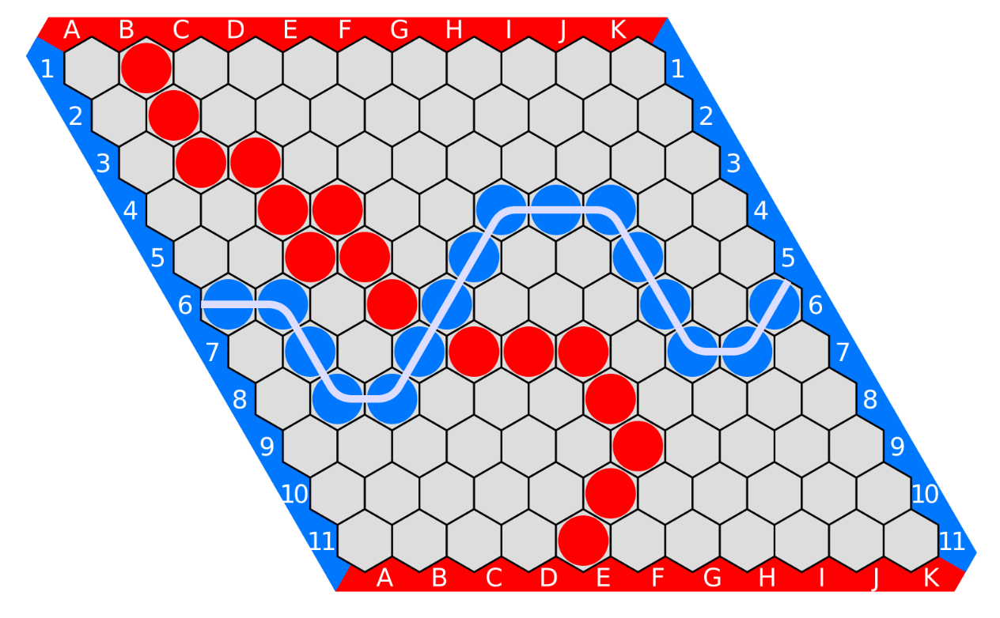

# 2.2 Hex

Hex este un joc pentru doi jucători care presupune o tablă sub formă de romb 11×11 cu slot-uri în care încap
piese hexagonale. Fiecărui jucător îi aparțin două margini opuse ale tablei (colțurile apațin amândurora).

Jucătorii plasează pe rând piese oriunde pe tablă. Câștigă cel care reușește
te primul să creeze un “pod” de piese de culoare proprie între cele două margini ale sale.

Figura 2: Tablă de joc cu configurație finală pentru jocul Hex
1. Alegeți o funcție de evaluare potrivită pentru această problemă și justificați alegerea făcută. (0.5p)
2. Implementați un joc complet AI vs AI și Human vs AI (input la fiecare pas de min) folosind algoritmul
Minimax cu alpha-beta pruning. (0.5p)
