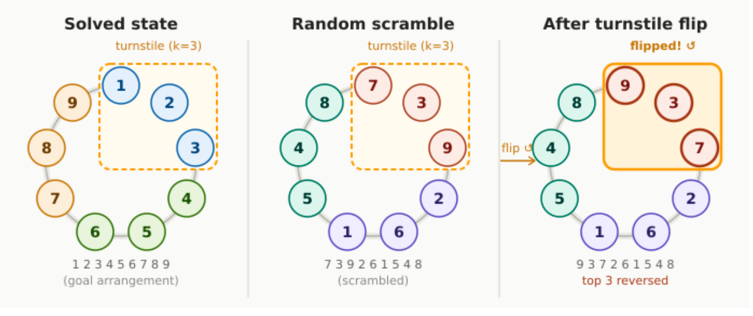

# 1.1 Topspin

Se consideră o bandă circulară pe care sunt așezate n piese numerotate de la 1 la n,
și într-un loc aleator se află un turnichet pe care încap fix k piese. 

Putem roti banda cum vrem noi, fără niciun cost. Putem întoarce
cele k piese de pe turnichet în orice moment. Vrem ca, în final, piesele să fie ordonate crescător în ordinea
acelor de ceasornic (de la dreapta la stânga), întorcând turnichetul de cât mai puține ori.

### Cerințe
1. Găsiți o euristică admisibilă și cât mai strânsă pentru problema dată. 
Justificați admisibilitatea euristicii. *(1p)*

2. Implementați algoritmul A* folosind euristica găsită. 
Dacă euristica este inadmisibilă, soluția nu se va puncta. *(1p)*

3. Implementați algoritmul IDA* folosind euristica găsită. 
Dacă euristica este inadmisibilă, soluția nu se va puncta. *(1p)*